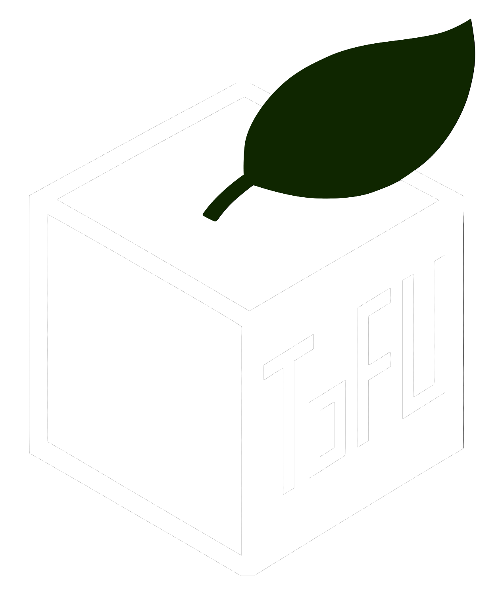
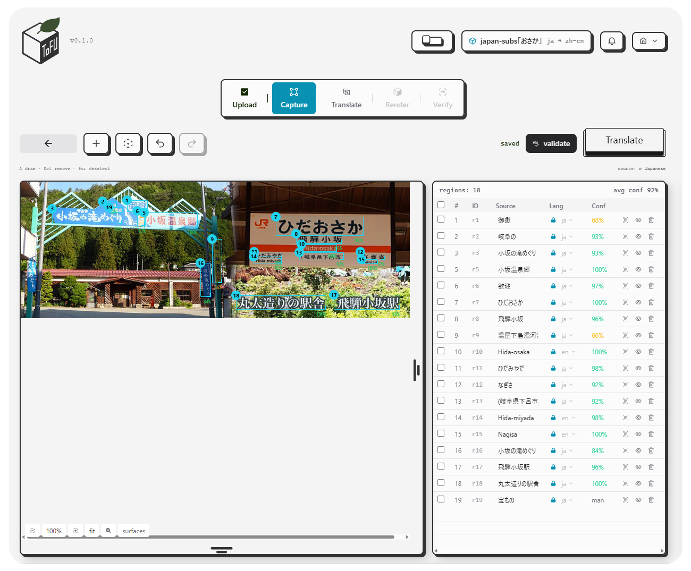
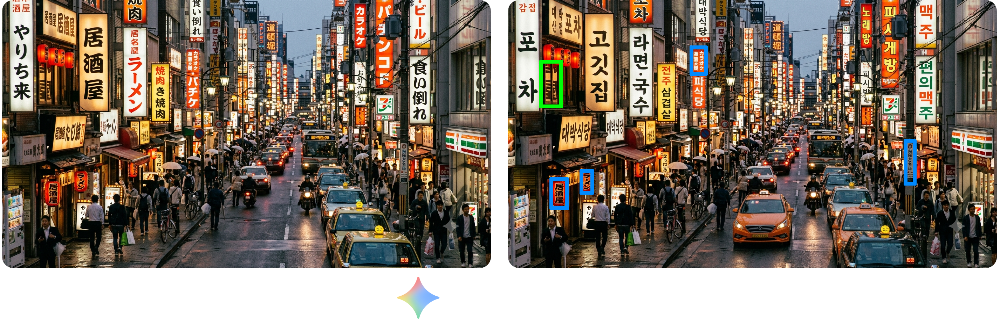
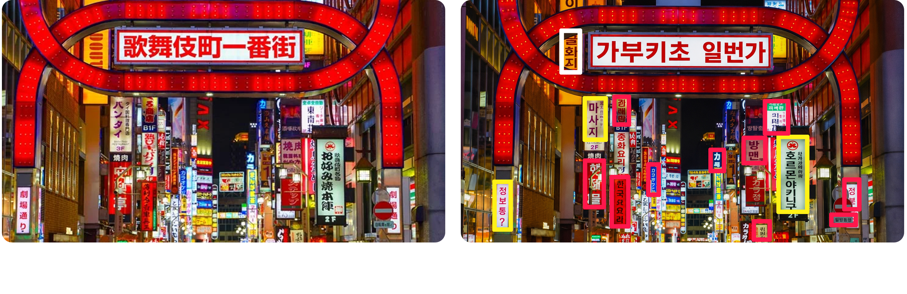
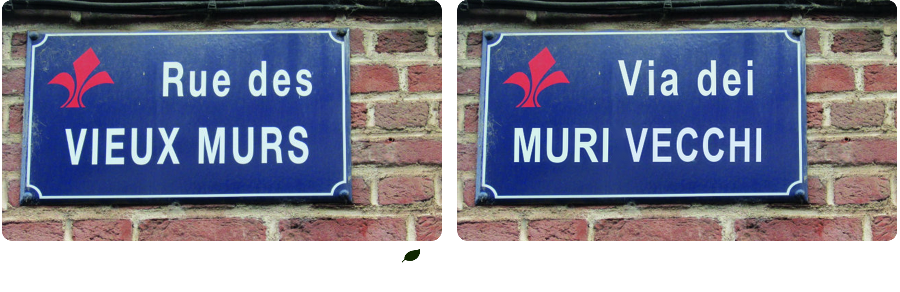
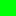

<div style="text" align="center">
  
   
</div>

---

<div style="image" align="center">
  
</div>

---

## Summary

ToFU (text-over-frame-unification) is a seven-layer visual translation pipeline that detects, erases, and re-renders text in images while preserving the original scene's visual context. Given a source image and a target language, ToFU runs text detection and recognition (Cicerone), semantic surface analysis (Scene), source-text erasure and background inpainting (Cleanse), style-matched target-language rendering (Scribe), and quality verification (Verify) — with a visual translation memory (Memory) that accumulates approved localizations for reuse on future assets. Three auxiliary modules — Savor, Menu, and Wasabi — operate as post-recognition quality-control passes inside Cicerone, correcting glyph-level confusions, recovering known place names, and normalizing CJK character variants. The pipeline is engine-agnostic (EasyOCR or PaddleOCR), runs entirely on CPU, and gates output on measurable accuracy thresholds.

---

<div style="image" align="center">
  
</div>

---

## Install as a library

The pipeline is packaged as `tofu-l10n` and usable without the server or the
frontend:

```
pip install tofu-l10n
```

The core install is deliberately light — Pillow, numpy, OpenCV, fontTools,
scikit-image — and does **not** pull PyTorch. That is enough to erase and
re-render text from a supplied manifest, which is the whole TMS round-trip
(import XLIFF → cleanse → scribe → export). Detection is an extra:

| Extra | Adds | For |
|---|---|---|
| `[ocr]` | easyocr (pulls torch, ~2 GB) | text detection and recognition |
| `[shaping]` | uharfbuzz, freetype-py | correct Indic/SE-Asian rendering |
| `[glossary]` | openpyxl, xlrd | .xlsx/.xls glossary ingest |
| `[server]` | fastapi, uvicorn | the REST API in `server/` |
| `[all]` | all of the above | |

```python
from tofu import TofuPipeline

result = TofuPipeline().process("sign.png", targ_lang="es")
```

Individual layers work standalone — they exchange a `TextManifest` and
nothing else:

```python
from tofu.layers import cicerone, scribe

manifest = cicerone.detect("sign.png")
image = scribe.render(cleansed, manifest, targ_lang="es")
```

`import tofu` pulls in no heavy dependency (~70 ms, no torch/OpenCV): the
orchestrator resolves lazily via PEP 562, so importing the dataclasses for a
CLI or a test costs nothing.

There is deliberately **no `[paddle]` or `[inpaint]` extra.** PP-OCRv5 (CJK
detection) and LaMa (neural inpainting) run out-of-process under their own
interpreters, because `paddlepaddle` force-replaces numpy and OpenCV on
install — an extra that pip-installed them would corrupt the environment
this package needs. Provision them as sibling venvs (see below); ToFU
discovers them at runtime and degrades cleanly when absent.

---

## Running the stack

**Backend** (Python 3.13 venv — required; easyocr's dependency tree is not yet reliable on 3.14):

```
py -3.13 -m venv .venv
.venv\Scripts\python -m pip install -r server\requirements.txt
cd server
set PYTHONUTF8=1
..\.venv\Scripts\python -m uvicorn main:app --reload --port 8000
```

Notes:
- `PYTHONUTF8=1` is required on Windows — EasyOCR's model-download progress bar prints characters that crash a cp1252 console.
- First detection downloads OCR models (~100 MB) to `~/.EasyOCR` and takes ~20 s; warm detections run in a few seconds on CPU.

### Dependency pinning

ToFU runs **three** interpreters on purpose, each with its own manifest:

| venv | manifest | purpose |
|---|---|---|
| `.venv` | `server/requirements.txt` | app + pipeline (CPU torch) |
| `.venv-paddle` | `server/requirements-paddle.txt` | PP-OCRv5, CJK detection — out-of-process |
| `.venv-inpaint` | `server/requirements-inpaint.txt` | LaMa neural repair (CUDA torch) — out-of-process |

Versions are pinned exactly (`==`), not floored (`>=`), so measurements in the technical paper are reproducible from the manifest. `server/requirements.lock.txt` is the fully-resolved transitive set for byte-identical rebuilds; regenerate it with `pip freeze` after any intentional dependency change.

**Install exactly one OpenCV distribution.** Multiple opencv wheels unpack into the same `site-packages/cv2/`, so whichever wrote last silently wins and the manifest stops describing what actually imports. This was a live bug: `opencv-contrib-python` 4.10 was shadowing a pinned headless 5.0, and Scene's contour rescue pass missed the banner on `images/japan-street.jpeg` as a result. Removing the duplicate fixed it with no code change. The server never opens a GUI window and no contrib-only module is used anywhere, so `opencv-python-headless` is the correct choice.

## OCR backends

Cicerone now supports two detection/recognition engines behind the same `OCRBackend` interface:

- **EasyOCR** (default): CRAFT detector + CRNN recognizer; mature for stylized scene text.
- **PaddleOCR** (opt-in): DBNet detector + SVTR_LCNet recognizer; generally stronger on rotated, curved, dense, and CJK street signs.

Switch the active engine per request with the `engine` query param (`/api/detect/stream?engine=paddleocr`) or via the `OCR_ENGINE` environment variable (`easyocr` or `paddleocr`).

PaddleOCR is **not** installed into the app venv and is never imported in-process — `paddlepaddle` force-replaces the app venv's numpy/opencv. It gets its own interpreter, installed from `server/requirements-paddle.txt`:

```
py -3.13 -m venv .venv-paddle
.venv-paddle\Scripts\python -m pip install -r server\requirements-paddle.txt
```

Cicerone locates it via `PaddleOCRBackend.is_available()` (defaults to `<repo>/.venv-paddle`, override with `TOFU_PADDLE_VENV`). When the venv is absent the backend degrades to `NullBackend` rather than raising — so a missing `.venv-paddle` shows up as *lost CJK recall*, not as a crash. Check `is_available()` first when CJK detection quality regresses.

## Architecture: pipeline layers

The pipeline runs in a fixed stage order: **ToFU** (pre-flight validation) → **Scene** (candidate surface detection) → **Cicerone** (multi-pass text detection + recognition, scene-filtered) → **ToFU** (re-validation with detected text) → **Scene** (per-instance style/background enrichment) → **Cleanse** (source-text erasure) → **Scribe** (target-language rendering) → **Verify** (quality scoring) → **Memory** (translation-memory storage). Scene runs twice — once before Cicerone to constrain detection, once after to enrich each detected instance with style and background data.

### ToFU — pre-flight validation (`src/tofu/layers/tofu.py`)

ToFU is the pipeline's gatekeeper. Before any heavy processing begins, it checks whether the target language can actually be rendered: which Unicode script the language uses, whether the font library covers that script's glyphs, and whether the detected text will fit in its bounding box after translation. A real `FontRegistry` (backed by `fonttools`) probes the system font directory for actual codepoint coverage rather than relying on a static lookup table — so a target language is only marked `FULL` when a covering font genuinely exists. Per-script support distinguishes Simplified Han (`Hans`), Traditional Han (`Hant`), Japanese (`Jpan`), and Korean (`Kore`) rather than collapsing all CJK under one generic label.

ToFU also runs a text-expansion feasibility check: using industry-standard horizontal expansion factors (e.g., German expands ~35% relative to English, Japanese contracts to ~60%), it predicts whether a translation will overflow its source bounding box. Regions that exceed a 1.05× ratio receive a warning; those above 1.35× are flagged as infeasible and blocked before Cleanse/Scribe run. When a `TextManifest` is supplied (e.g., after Cicerone detection or from frontend-supplied regions), ToFU re-validates with real per-region data rather than heuristics alone.

### Cicerone — text detection & recognition (`src/tofu/layers/cicerone.py`)

Cicerone is the pipeline's eye. It finds every text instance in the asset and produces the `TextManifest` that all downstream layers consume: bounding boxes, segmentation polygons, OCR text, confidence scores, and per-region language identity. Detection is multi-pass — an initial full-frame scan, then adaptive re-detection on under-covered regions, then zoom passes into scene-identified surfaces at 2× resolution. A scene-filter stage uses the candidate surfaces from Scene's pre-pass to suppress false positives: detections inside panels and text clusters survive at lower confidence thresholds (text is very likely there), while detections in open areas must clear a higher bar.

Two OCR engines are supported behind the same `OCRBackend` interface:

- **EasyOCR** (default): CRAFT detector + CRNN recognizer. Mature for stylized and curved scene text; returns 4-point polygons mapped directly to `InstText`.
- **PaddleOCR** (opt-in): DBNet detector + SVTR_LCNet recognizer. Generally stronger on rotated, curved, dense, and CJK street signs — measured at 4× recall and 4× transcription accuracy over EasyOCR on dense vertical CJK scenes. Runs out-of-process via `scripts/paddle_worker.py` under an isolated `.venv-paddle` interpreter (paddlepaddle force-replaces the app venv's numpy/opencv on install, so it can never be imported in-process).

Switch the active engine per request with the `engine` query param (`/api/detect/stream?engine=paddleocr`) or via the `OCR_ENGINE` environment variable (`easyocr` or `paddleocr`).

See [OCR backends](#ocr-backends) for the `.venv-paddle` setup and why PaddleOCR is never installed into the app venv.

Cicerone also handles CJK-specific challenges: vertical column merge (`merge_vertical_columns`) unifies x-aligned, width-matched, tightly-stacked character boxes into single column detections; language arbitration ranks candidate readers by corroborating-region count and confidence rather than confidence alone (preventing a confidently-wrong reader from hijacking the scene); and a two-phase scene filter lets a detection survive the confidence floor with its best recognition rather than its first. A `_split_tall_detections` pass re-segments over-tall vertical CJK signs into per-character bands and re-recognizes each, feeding results through the column reassembly.

### Scene — semantic context & style analysis (`src/tofu/layers/scene.py`)

Scene has two jobs. First, a pre-pass (`analyze_regions`) detects candidate text-bearing surfaces — signs, panels, bordered regions — *before* text detection runs. Cicerone uses these to constrain detection and suppress false positives. The default `ClassicalCVBackend` combines two complementary detectors:

- **Contour analysis** (Canny edges + `approxPolyDP`): finds structural surfaces — panels, bordered regions, signs. An adaptive rescue pass retries with higher thresholds and Gaussian blur when the default pass finds zero real candidates (recovering large banners in visually cluttered scenes where edge detection saturates).
- **MSER** (Maximally Stable Extremal Regions): finds text-like blobs — individual characters and short strings that contour analysis misses. Blobs are spatially clustered into bounding boxes labeled `"text_cluster"`.

Surface deduplication is orientation-aware: a small horizontal English label sitting on a large vertical CJK sign is not discarded as a duplicate of the sign, even though it's >85% contained within it — the orientation bucket (wide/tall/square) must also match.

Second, an enrichment pass (`analyze`) fills per-instance `StyleProfil` (estimated text color, font weight, italic, size) and `BgProfil` (background color, texture classification, containing surface label) used by Cleanse for faithful inpainting and by Scribe for style-matched re-rendering. Existing user-set values are never overwritten.

#### Glyph binarization (`utils/imaging.text_mask`)

Style estimation, typography analysis, Cleanse's erasure masks, Savor, and font matching all bottom out in one function, so its binarization quality propagates to four layers at once. The text/background split is thresholded either globally by **Otsu** (Otsu 1979) or locally by **Sauvola** (Sauvola & Pietikäinen 2000, *Adaptive document image binarization*, Pattern Recognition 33(2):225–236), chosen per crop rather than fixed:

- Otsu assumes a bimodal histogram and one threshold for the entire crop. That is correct on flat signage and wrong under a lighting gradient, where no single cut exists and Otsu necessarily swallows the shaded end of the background as ink.
- Sauvola derives a per-pixel threshold from the local mean and standard deviation, so it is immune to that gradient, but pays mild window noise on flat crops.

A low-pass illumination estimate (`_uneven_soak`) picks between them: crops whose background trend spans more than 40/255 grey levels take Sauvola, the rest keep Otsu. On a controlled gradient crop this lifts mask IoU from **0.258 to 0.927**, while flat crops hold at **0.985** — a blanket switch to Sauvola would have regressed those flat crops to 0.906, which is why the choice is per-crop. Measured against the annotated street-scene ground truth, **27% of real regions** (9/33) exceed the floor and take the local path.

Sauvola degrading — scikit-image absent, or a mask that comes back all ink or all ground — falls through to Otsu rather than failing, so the function can only match or beat its previous Otsu-only behaviour. Whichever wins, text is assumed the minority class and the result is refined with **GrabCut** (Rother et al. 2004) when the crop is large enough for its border ring, which is far more robust on textured backgrounds.

### Cleanse — text erasure & inpainting (`src/tofu/layers/cleanse.py`)

Cleanse removes source text from the asset and reconstructs the background underneath. The erasure mask is the glyph's own stroke shape (Otsu/Sauvola + GrabCut, dilated a few pixels for anti-aliased edges — see [Glyph binarization](#glyph-binarization-utilsimagingtext_mask)) rather than the whole bounding box rectangle — the previous implementation also filled the full padded bbox unconditionally, which forced the inpainter to hallucinate the entire box interior and produced the leftover-artifact failure mode documented in the project workplan. The bbox rectangle is now a fallback used only when segmentation genuinely fails.

The inpainting strategy is selected from Scene's `BgProfil.texture` classification, so Cleanse and Scene agree on what kind of surface they're looking at:

- **Flat** surfaces (solid panels/signs): border-ring median color fill — fast and exact, since there's no texture to lose.
- **Smooth gradients**: per-channel linear plane reconstruction fit over the border ring (the same shading model Scene fits for classification, re-fit here over the actual erasure footprint).
- **Textured or unclassified**: OpenCV content-aware inpainting (Telea 2004), batched into one pass with radius scaled to the detected stroke width.

Every fill is alpha-feathered at the mask boundary (distance-transform falloff) so no strategy leaves a hard seam. Excluded regions (user-removed from the workspace) are still erased — only their rendering is skipped, unlike DNT regions which are left untouched entirely.

### Self-hosted neural repair and promotion gates

Cleanse now uses an evidence-gated provider router rather than exposing a
"smooth versus texture" choice in the editor. Scene and instance agreement
on a flat panel or smooth gradient uses deterministic reconstruction and is
auto-accepted. Every textured or uncertain surface is recorded with
per-region repair provenance. Without a provisioned neural provider, ToFU
uses a deterministic Telea fallback only as a review-required candidate; it
is never silently promoted to a trusted cleansed base.

Neural providers activate through `server/inpainting-providers.json`; copy
`server/inpainting-providers.example.json`, then point each enabled provider
at its own local Python environment, checkout, and checkpoint. The application
process never imports their Torch/diffusers stacks: it passes temporary local
image/mask/output files to the configured interpreter and rejects an output
whose dimensions do not exactly match its input. This keeps LaMa, BrushNet,
and their pinned dependencies from destabilizing OCR or the web backend.

LaMa's `official_lama` runtime targets the upstream `advimman/lama` checkout
and a local `big-lama` model directory. BrushNet's runtime targets the upstream
TencentARC checkout, a local base model, and a local BrushNet checkpoint; it
uses a fixed seed and preserves all known pixels outside ToFU's mask. Both are
available to the automatic router as soon as their config validates. The
router prefers LaMa for lower-complexity/repeating texture and a configured
DiffSTR/BrushNet path for high-detail local texture.

DiffSTR is supported through the same `external_command` file contract, but
the paper currently has no public runnable code/checkpoint to provision. A
validated local DiffSTR runner can be activated by filling its command and
required-path fields; ToFU will not label a generic diffusion model as
DiffSTR. Run `scripts/eval_cleanse_providers.py` against the fixture set before
changing any provider's `promoted` field to `true`; an installed model cannot
become an auto-accept default without benchmark evidence. No source image is
sent to a cloud service by this architecture.

The Localized Asset Canvas starts from this cleansed base. Its healing brush
and lasso create ordered, RGBA treatment patches over that base, so every
manual correction is non-destructive and undoable. It also keeps the source
reference visible while typography placement, rotation, skew, and arc warp
are adjusted over the treatment result.

### Scribe — style-aware text regeneration (`src/tofu/layers/scribe.py`)

Scribe renders target-language text onto the cleansed asset, matching the source styling captured by Scene. Per region, it renders `inst.target_text` (untranslated and excluded regions are skipped), wrapped to fit the bounding box (greedy word-wrap for space-delimited scripts, character-wrap for CJK), and sized by a binary search over both the wrap and the font size together. Text is colored and faded per `StyleProfil` + opacity, optionally rotated, and alpha-composited onto the asset.

Font resolution anchors a sibling-face search on the fallback font that would otherwise be used: when `font_family` is `None` but `font_weight` or `italic` is explicitly requested (the common case, since typography detection sets weight independently of any explicit font pick), Scribe finds a real bold or italic sibling face in the same family rather than silently rendering plain Arial. Vertical CJK column rendering is supported for narrow-and-tall regions in vertical-writing languages — characters are stacked top-to-bottom, each rendered upright.

Italic is rendered on a layer sized to the text's own extent and sheared around its own local origin before compositing — not the whole base-image-sized layer sheared by each pixel's absolute y-coordinate, which was a real bug that bled a region's ink far outside its detection bbox.

#### Right-to-left scripts

Pillow's `BASIC` layout engine draws the codepoints it is handed, in the order it is handed them, at the advances the font declares — and nothing else. It neither reorders bidirectional runs nor substitutes cursive joining forms, so Arabic passed straight to `draw.text()` renders as disconnected isolated letters in visually reversed order.

Scribe therefore runs two passes for RTL target languages, keyed on the target's Unicode script (`Arab`, `Hebr`, `Syrc`, `Thaa`, …) rather than a hardcoded language list:

1. **`press_joins`** — contextual joining forms via `arabic-reshaper`, for Arabic-script languages only (Hebrew doesn't join). This runs *before* measuring, fitting, and the glyph-coverage guard, because reshaping emits presentation forms (U+FE70–FEFF) and it is those codepoints — not the base letters — that the resolved face must contain. A font carrying the base Arabic block but not the presentation block is then caught and swapped like any other coverage gap.
2. **`serving_order`** — logical→visual reordering via `python-bidi` (UAX #9), applied *per line and after wrapping*, since the algorithm is defined on a display line. Reordering the paragraph first and wrapping afterwards would split reordered runs across the fold. Base direction is pinned to RTL rather than auto-detected, so an Arabic caption opening with a Latin brand name still lays out RTL-base.

Both degrade to a pass-through when their library is missing, and both are no-ops for every LTR language — verified by a test asserting Latin output is byte-identical with the RTL passes stubbed out.

#### Complex-script shaping (`layers/knead.py`)

Brahmic scripts reorder vowel signs around their consonant and fuse consonant clusters into conjuncts, and BASIC layout does neither — `हिन्दी` draws as six glyphs in logical order with the i-matra stranded on the wrong side of its consonant, where correct shaping is four glyphs with it moved left; `क्ष` is one conjunct and draws as three. These are rendered *wrong*, with no working fallback.

Scribe therefore routes a fixed set of scripts through **HarfBuzz** (`uharfbuzz`) for shaping and **FreeType** (`freetype-py`) for rasterization, replacing Pillow's text API for those regions only. `SHAPED_SCRIPTS` covers Indic and South-East Asian: `Deva Beng Guru Gujr Orya Taml Telu Knda Mlym Sinh Thai Laoo Khmr Mymr Tibt`.

Everything else deliberately stays on Pillow:

- **Latin, Cyrillic, Greek, CJK, Hangul.** Shaping would only add kerning — cosmetic, not a correctness fix — and it re-flows every existing render. Measured at −1.75% aggregate width but −7.84% on a string like `AVATAR`; since `_fit_wrapped` binary-searches font size to fill the box, a narrower line can cross a size boundary and come back a whole step *larger*. That migration is a deliberate future step, not a side effect of this one.
- **RTL.** `press_joins`/`serving_order` already render Arabic and Hebrew correctly, and HarfBuzz shapes one direction per run with no bidi itemization — routing mixed Arabic+Latin (brand names on signage) through it would regress what works today.

Two invariants hold this together. **Measurement and drawing switch together**: the fitter binary-searches font size against measured extent, so measuring with shaping and drawing without would overflow the box — eligibility is a pure function of (script, font, availability), and both sides derive from the same `ShapedRun`. **Coordinate frames convert once**: Pillow anchors at the ascender, FreeType at the baseline, so `baseline_y = y + ascent` is applied in one place and every downstream consumer — alignment, underline, italic shear, shadow — works unchanged.

Letter spacing (`tracking`/`kerning`) is applied at **cluster** boundaries, not between glyphs: a conjunct or a base-plus-marks is several glyphs belonging to one cluster, and spacing those apart would undo the shaping.

`TOFU_SHAPING=0` disables the whole path at runtime. Verified pixel-identical output on a full street render with shaping on versus off, since no street fixture is Indic.

**Still not covered**: OpenType kerning/ligatures for Latin and the other unshaped scripts. That needs either the migration above or Raqm (HarfBuzz + FriBiDi), which is **not** reachable by configuration — Pillow's Windows wheel is compiled without it:

```python
>>> from PIL import _imagingft
>>> _imagingft.HAVE_RAQM, _imagingft.HAVE_FRIBIDI, _imagingft.HAVE_HARFBUZZ
(False, False, False)
```

These are compile-time constants baked into the wheel, not runtime probes, so no DLL placement changes them. Installing FriBiDi (mingw-w64 `libfribidi-0.dll`, whether on `PATH`, beside `python.exe`, or registered via `os.add_dll_directory`) leaves `PIL.features.check("raqm")` returning `False` — measured, not assumed. Reading `raqm`/`harfbuzz`/`fribidi` symbol names out of `_imagingft*.pyd` is misleading: those strings are the attribute names Pillow always exports, plus compiled-out code paths.

The second route — `uharfbuzz` + `freetype-py` — is the one ToFU took, and is described above. Extending it from complex scripts to *all* scripts is the remaining step; the engine already supports it, only the `SHAPED_SCRIPTS` gate stands in the way.

### Verify — quality verification (`src/tofu/layers/verify.py`)

Verify scores the localized asset per instance and gates the pipeline on `overall_score >= qa_threshold`. Five metrics, all standard in the scene-text editing literature:

1. **OCR round-trip legibility** — re-recognize the rendered target text and compare against the intended string. If the OCR that found the source text cannot read the rendered target, the render failed for the same reasons a human reader would struggle.
2. **Background reconstruction (SSIM)** — structural similarity between source and localized asset over a border ring just outside each bbox. Cleanse/Scribe must not disturb pixels beyond the region.
3. **Ink presence** — when EasyOCR is unavailable, a rendered region must still show evidence of rendering: pixel change against the source inside the bbox plus glyph edge energy.
4. **Residual source text** — re-recognize the cleansed (pre-Scribe) crop and compare against the original source string. A high similarity means the source text survived the erase — a double-exposure defect that multiplies the instance's score down rather than averaging in.
5. **Style consistency** — CIE76 color ΔE between detected source text color and mean ink color sampled from the rendered crop, plus a rendered-height ratio against the detected source size.

Coverage accounting is enforced: untranslated non-DNT regions receive a real deduction rather than a neutral score, so an incomplete localization can no longer inflate its own gate by skipping regions. The `QAReport.progress` dict carries the full regions_total/dnt/excluded/translated/untranslated/fallback_font breakdown for the frontend to render as a coverage summary.

### Memory — visual translation memory (`src/tofu/layers/memory.py`)

Memory stores accepted (source region, target render, style, QA score) tuples for reuse: identical or near-identical source text regions in future assets can be localized from memory instead of re-running the pipeline. Matching uses a three-tier cascade — exact text match, fuzzy text similarity, then visual pHash fingerprint — with a style fingerprint (weight/italic/color) as a tiebreaker between equally-scored candidates.

QA gating is enforced here as well as in the pipeline: a visual TM poisoned with bad localizations is worse than no TM, so `update()` refuses to store results below the threshold regardless of caller. The module is storage-agnostic by design — `update()` returns draft records (plus a ready-to-save thumbnail crop) and `lookup()` matches against a caller-supplied candidate pool. `server/main.py` owns the actual SQLite writes and thumbnail-file saves, keeping this module pure and testable with plain Python objects.

### Savor — post-recognition glyph correction (`src/tofu/layers/savor.py`)

Savor is Cicerone's quality-control taste tester. Before recognized text leaves the detection pipeline, Savor samples every suspicious bite and only swallows a correction when the evidence backs it up. It runs alongside Cicerone's other post-recognition passes (second_look, prune_hallucinations, zoom, adaptive) as one more QC step on the same raw output.

Four courses, deliberately kept separate so nothing gets corrected on a guess:

1. **Sniff** (`sniff_out`): a cheap context check — is there a whole token shaped like something a digit was expected in (e.g., an hour before "am"/"pm"), where swapping a confusable glyph's digit counterpart would make it valid? Sniff only proposes candidates; it never rewrites anything.
2. **Chew** (`chew_on`): the actual verification. Segments the ambiguous glyph's own pixels out of the region (connected-component analysis), renders both candidate characters as reference glyphs at matching size, and compares shapes. Only a clear margin settles it — a coin-flip-close comparison is left inconclusive.
3. **Swallow or spit** (`taste`): a correction is only applied when `chew_on()` confirms the digit. Confirmed-letter candidates are rejected; inconclusive ones are recorded on `InstText.ocr_correction` with `applied=False` for human review.
4. **Dakuten** (`sniff_dakuten`): detects when Japanese kana readings are missing their dakuten/handakuten marks by matching against Menu's gazetteer of known real place names. If toggling the differing positions' marks produces a known name at sufficient fuzzy-similarity, the correction is proposed. Every differing character must be a known dakuten relation — a single non-dakuten diff aborts the entire proposal.

### Wasabi — CJK glyph normalization (`src/tofu/layers/wasabi.py`)

PaddleOCR's Japanese language selector doesn't receive a Japanese-specific recognition model — it resolves to the same shared PP-OCRv6 model used for Chinese and English, whose CTC vocabulary contains both simplified-Chinese-only and correct Japanese shinjitai glyph forms as separate valid output tokens with no language conditioning. A `ja`-labeled read can confidently emit a Chinese-only character (measured: `劇場通り` read back as `剧場通`, `焼肉` as `烧肉`). Wasabi corrects this after the fact: `season()` swaps any known simplified-Chinese-only glyph for its Japanese shinjitai equivalent across every ja-labeled instance. The correction table is deliberately curated rather than a full Unihan variant table — most simplified forms actually match Japanese shinjitai (both diverged independently from the same traditional form and landed on the same simplification), so only genuinely observed divergent pairs belong here.

### Menu — gazetteer-assisted place-name recovery (`src/tofu/layers/menu.py`)

A low-confidence OCR read of a real, well-known place or establishment sign (a train-station gate, a named street, a chain storefront) can often be recovered by checking it against a small list of known names, even when the pixels alone weren't legible enough. Menu uses a stricter gate than Savor's pixel-verified glyph swaps: it only touches reads the recognizer was already unsure about (confidence below 0.6), and only applies a candidate that's a strong fuzzy match (similarity ≥ 0.5). The gazetteer is seeded for the project's dense-CJK-signage test scenes but is designed to grow with whatever real signage future assets turn up — not a fixed answer key for one image. Menu also serves as the reference gazetteer for Savor's dakuten course.

## Evaluation and accuracy work

The `scripts/eval_detect.py` harness now reports detection **precision/recall/F1** and **normalized edit distance** when a ground-truth file is supplied:

```bash
# create a ground-truth file next to the image: my-image.gt.json
.venv\Scripts\python scripts\eval_detect.py images/my-image.png --tag baseline --ground-truth images/my-image.gt.json

# compare PaddleOCR
.venv\Scripts\python scripts\eval_detect.py images/my-image.png --tag paddle --engine paddleocr --ground-truth images/my-image.gt.json
```

Ground-truth JSON format:

```json
{
  "regions": [
    {"bbox": [x, y, width, height], "text": "correct text"}
  ]
}
```

## Manual bounding-box snap

When a user draws a rough box on the capture screen, the UI now calls `POST /api/detect/refine` with the crop and snaps the box to the highest-confidence detected text polygon. The endpoint is also usable directly:

```bash
curl -X POST "http://localhost:8000/api/detect/refine" \
  -H "Content-Type: application/json" \
  -d '{"asset_id": "...", "bbox": {"x": 100, "y": 200, "width": 300, "height": 80}}'
```

**Frontend** (proxies `/api` to port 8000):

```
cd frontend
npm install
npm run dev
```

Open http://localhost:5173.

---

## LLM Comparison

<div style="image" align="center">
  
</div>


<div style="image" align="center">
  
</div>


<div style="image" align="center">
  
</div>


<div style="image" align="left">
  
 residual artifacts

 untranslated strings

 mistranslated strings

 unorthodox translations

 mistranslated strings

</div>

---

<div align="center">


Made with ❤️
</div>
