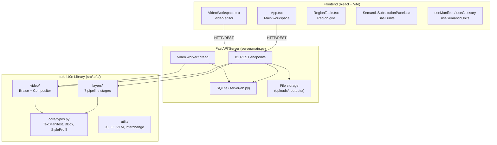
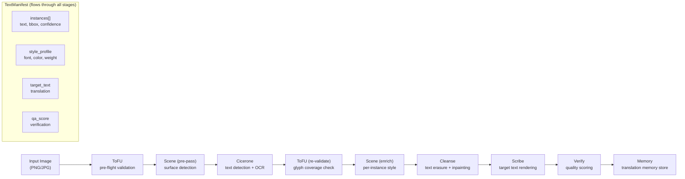
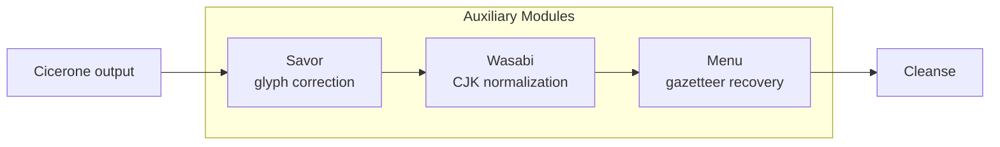
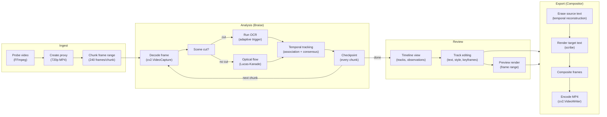
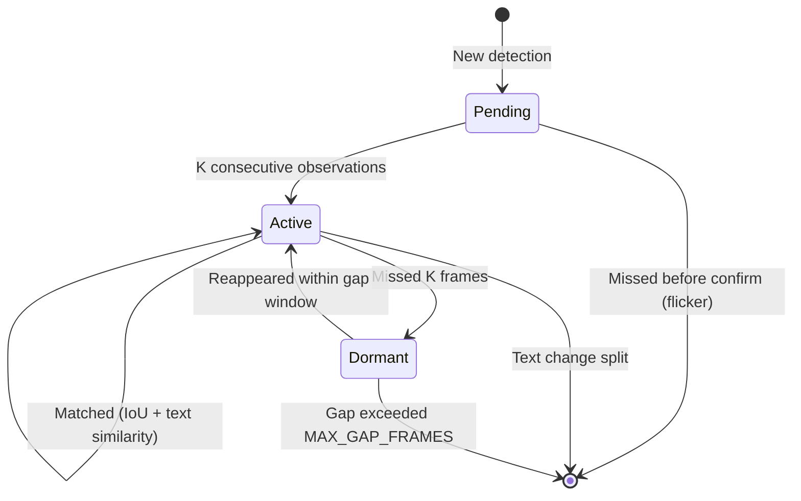
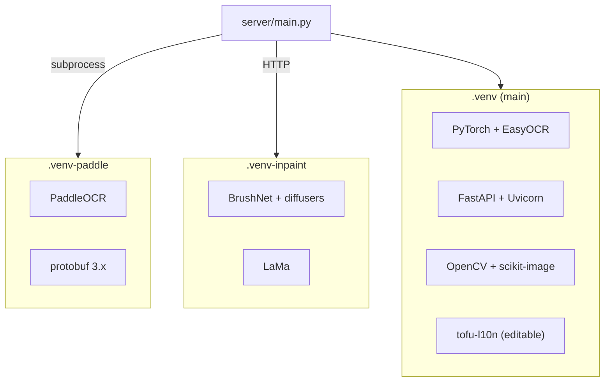
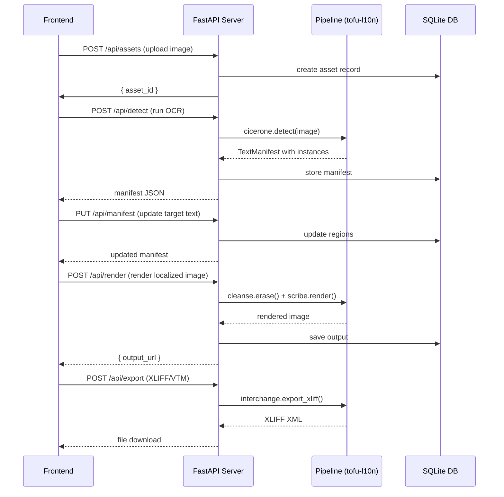
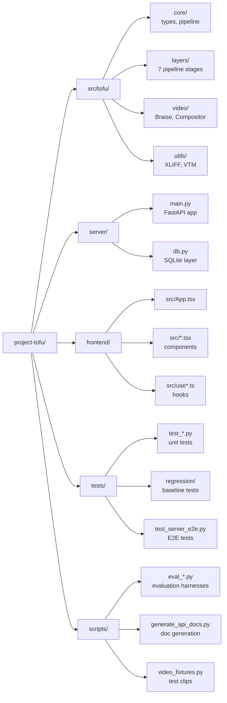

# ToFU Architecture

This document provides a visual overview of the ToFU system architecture,
complementing the detailed [cross-layer architecture](cross-layer-architecture.md)
and the [API reference](api.md).

## System Overview

ToFU is a three-tier system: a React/Vite frontend, a FastAPI server, and a
Python pipeline library (`tofu-l10n`). The frontend communicates with the
server via REST; the server orchestrates the pipeline layers and manages
SQLite-backed project state.

## Image Pipeline (7 Layers)

The image pipeline processes a single image through a fixed stage order.
Each layer receives and enriches a `TextManifest` — the single data structure
that flows through the entire pipeline.

### Auxiliary Modules

Three auxiliary modules run alongside the main pipeline:

## Video Pipeline

The video pipeline extends the image workflow with temporal tracking and
frame-by-frame compositing.

### Temporal Tracking Edge Cases

## Three-Venv Architecture

ToFU uses three separate Python virtual environments to isolate incompatible
dependencies (EasyOCR needs torch, PaddleOCR needs its own protobuf, the
server needs FastAPI).

## Data Flow: Frontend ↔ Server ↔ Pipeline

## Project Layout

## Key Design Principles

1. **Single data structure**: A `TextManifest` flows through every pipeline
   layer. No layer reaches into another's internals — they exchange the
   manifest and nothing else.

2. **Storage-agnostic layers**: Pipeline layers are pure functions that take
   and return manifests. The server owns all persistence (SQLite, file I/O).

3. **Three-venv isolation**: Incompatible dependencies (torch vs PaddleOCR vs
   diffusers) are isolated in separate venvs, communicating via subprocess/HTTP.

4. **Resumable video jobs**: The Braise tracker captures its state at chunk
   boundaries as a `TrackerCheckpoint`, enabling exact resume after interruption.

5. **Preview/export parity**: Video preview frames are byte-identical to export
   frames on their shared range — a preview is a window onto the export, not a
   different render.
